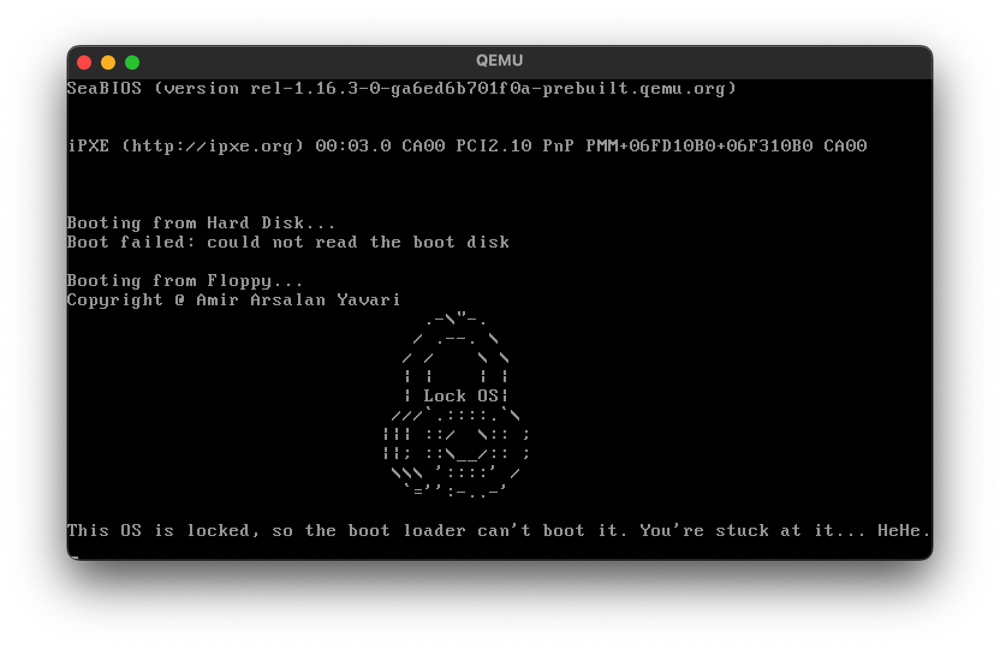

# Bootloader

A bootloader written in NASM assembly.

## Compilation

To compile the bootloader, use the following command:

```bash
nasm -f bin boot.asm -o boot.bin
```

## Running

```bash
qemu-system-x86_64 -drive format=raw,file=boot.bin
# OR
qemu-system-i386 -fda boot.bin
```

## Screenshot


